

    

**Authograph** is a way for photo-journalists and content creators to display a rich visual overlay of metadata onto their web-based images. Announced at World Press Photo Foundation awards ceremony 2016, this simple drop-in javascript library automatically augments seleted photos with additional content, curated by the content owner.

See the [Project Site](https://fourcorners.io) for more background on the project and future directions.

[Click Here](https://digitalinteraction.github.io/fourcorners/docs/) to see a live demo in action.

# Installing the Plugin

[Download the plugin](https://github.com/digitalinteraction/fourcorners-wordpress/releases/download/1.3/wp-authograph.zip) from our repository to your local computer.

In your Wordpress admin panel `admin > add plugin > upload plugin`:

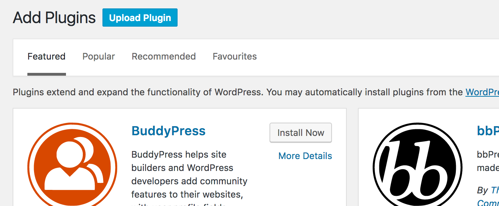

Upload the file you downloaded above:

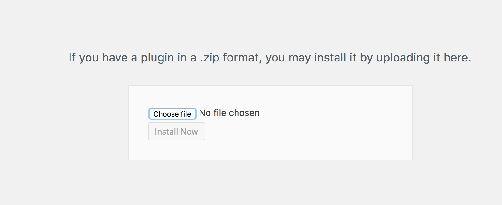

Activate the plugin:

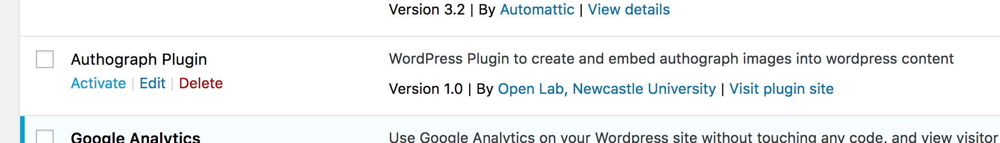

# Using the Wordpress Plugin

Follow the following steps for each image that you want to add Authograph metadata to:

## Step 1 - Login
Login to Wordpress using your details:

`http://<yoursite>/wp-admin`

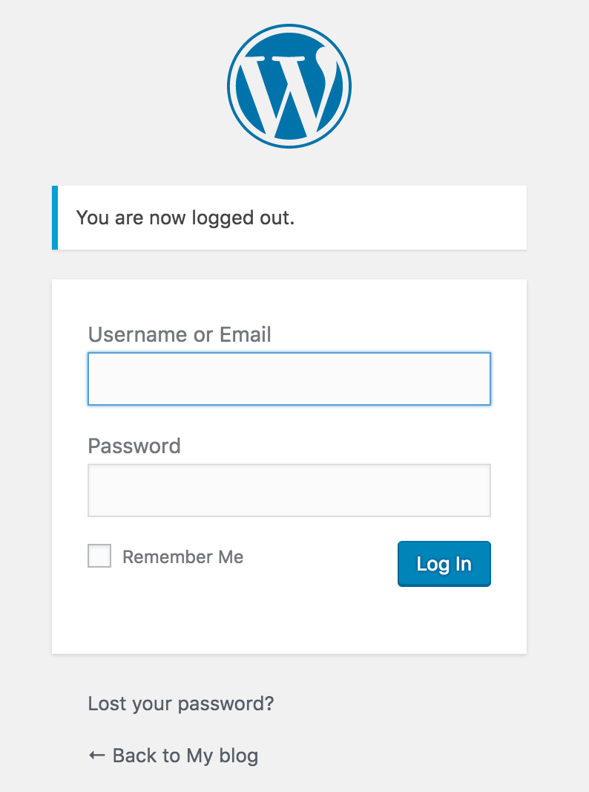

## Step 2 - Add an Authograph image to your site

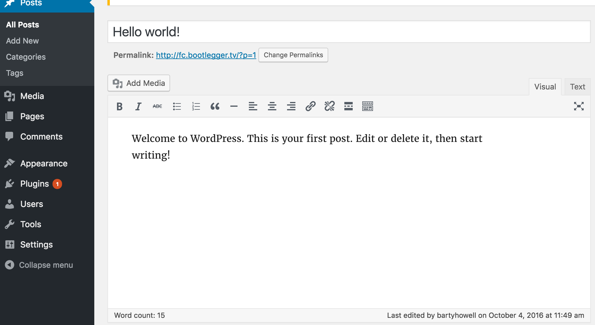

Select the *Insert Authograph* button on the toolbar: 

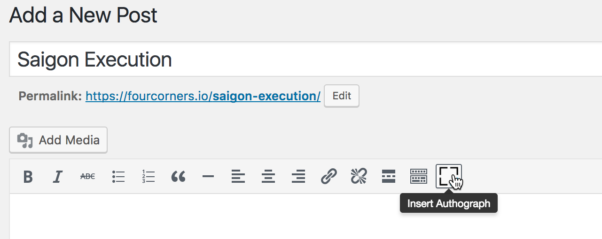

Select your image (by uploading or selecting a previously uploaded image):

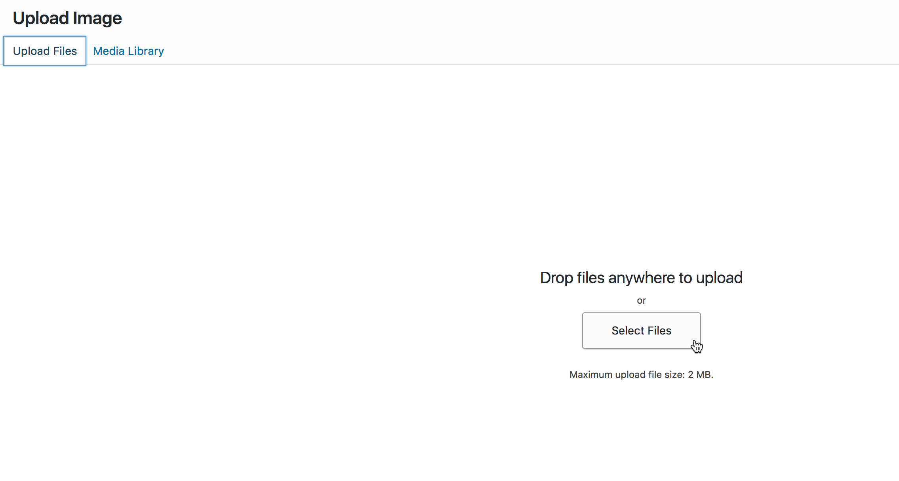

Fill in metadata about the image:

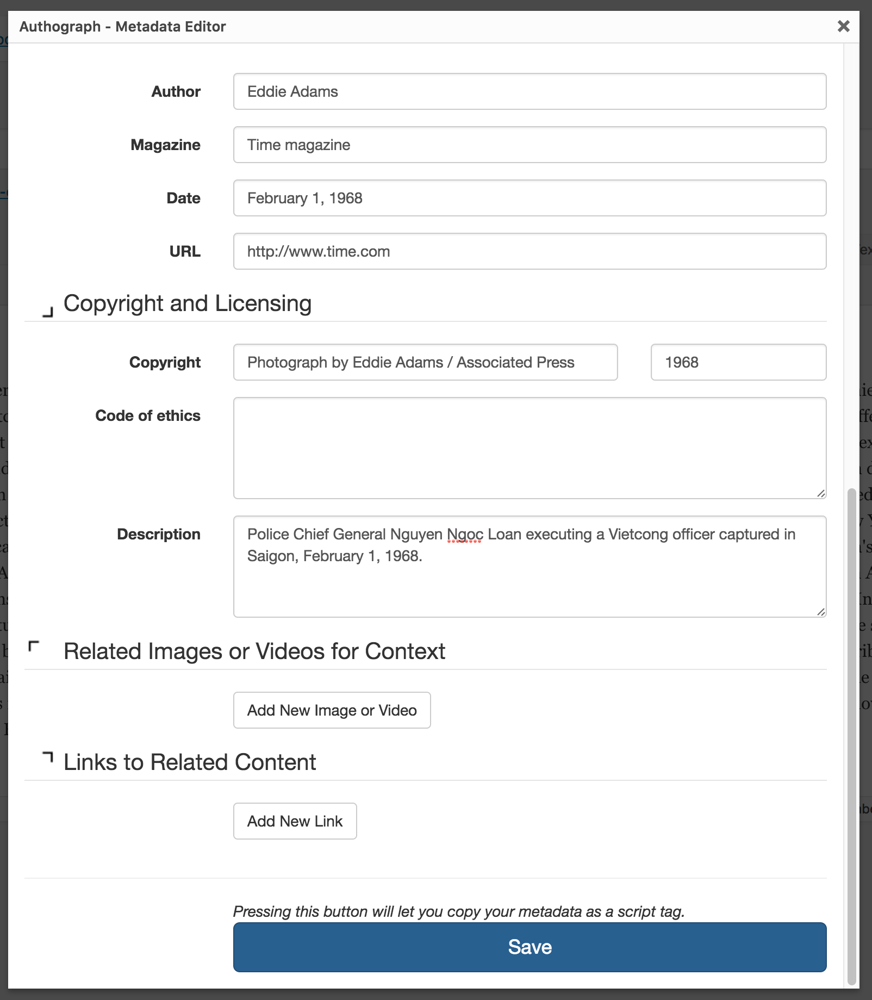

Press `Save` to insert the augmented image into your post.

> Note the small icon next to the image -- do not delete this, it will not be shown on your site.

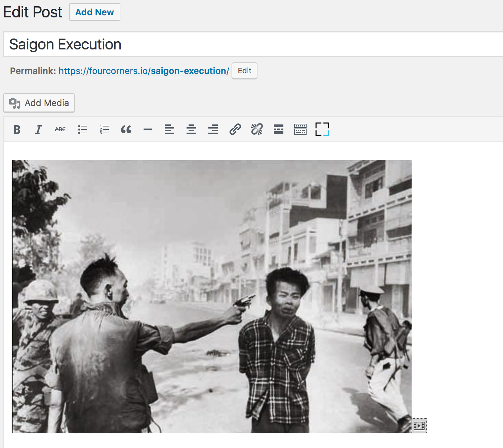

For reference, vieing your post in `Text` view will show your metadata alongside your image in the post. 

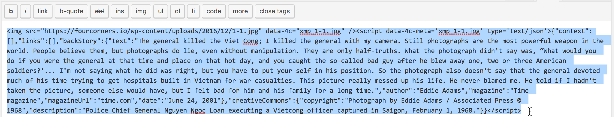

Visiting your page will now augment your image with your metadata when you hover over the corners.

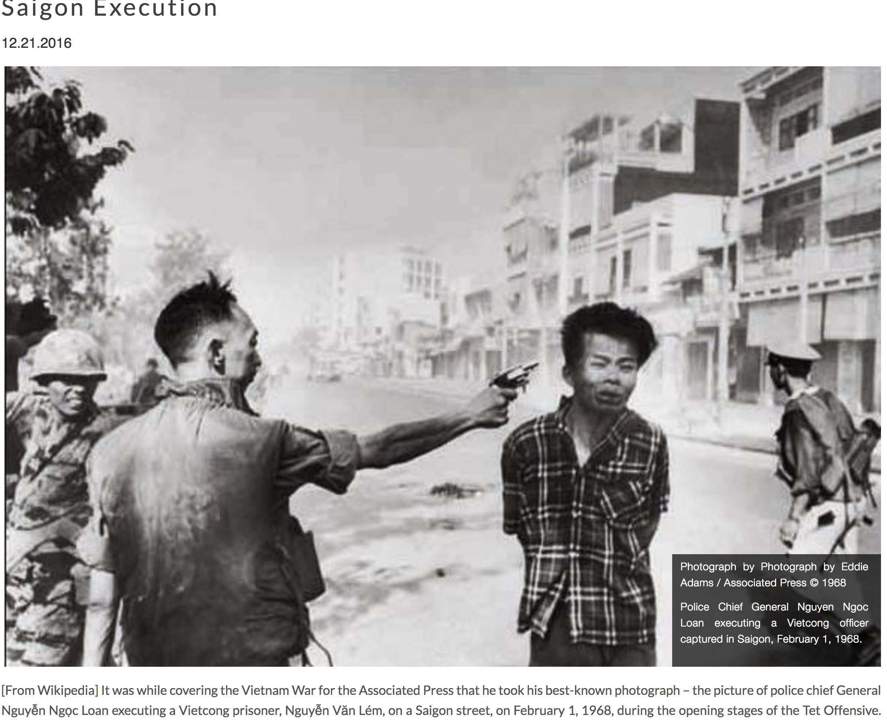

----

> Authograph is an open source initiate delivered as part of a collaboration between leading universities and journalist organisations. If you would like to find out more, please contact us directly <info@authograph.org>.  Content imagery used in the demo is photography by Eddie Adams/© Associated Press.
