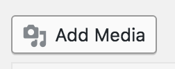
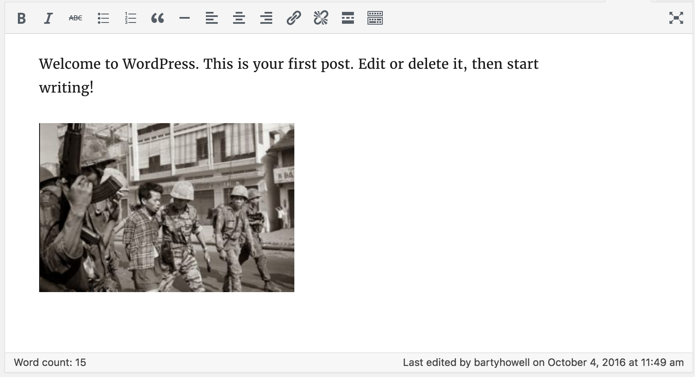

    

**Authograph** is a way for photo-journalists and content creators to display a rich visual overlay of metadata onto their web-based images. Announced at World Press Photo Foundation awards ceremony 2016, this simple drop-in javascript library automatically augments seleted photos with additional content, curated by the content owner.

See the [Project Site](https://fourcorners.io) for more background on the project and future directions.

[Click Here](https://digitalinteraction.github.io/authograph/docs/) to see a live demo in action.

## Installing the Plugin

[Download the plugin]() and add to site using the Wordpress admin panel.

## Using the Wordpress Plugin

Follow the following steps for each image that you want to add Authograph metadata to:

# Step 1 - Login
Login to Wordpress using your details:

`http://<yoursite>/wp-admin`

# Step 2 - Add an Authograph image to your site

Upload the image:

Add to the post:

Press `Update` and save your post.

Visiting your page will now augment your image with your metadata when you hover over the corners.

----

> Authograph is an open source initiate delivered as part of a collaboration between leading universities and journalist organisations. If you would like to find out more, please contact us directly <info@authograph.org>.  Content imagery used in the demo is photography by Eddie Adams/© Associated Press.
